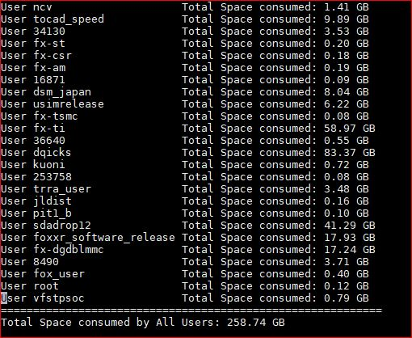

# File-Size-Calculation-Script
This is the Shell Script to check the File-Size per user basis and reports them in a table and later Summarise the total Size of all User accounts at the end of the output.

This is small awk snippet which takes the Files from the find command where it looks the file Size more than 1MB and list them with the all the information except the group of the file. However, It sorts the file owner and based on individual users then aggregats their size consumed by them and displays that along and at the end it summrises the total size consumed by all the users for a given mount.

I have two scripts with almost the same name:

a) FileSize_per_User.sh  <-- this does what i described above

b) FileSize_per_User1.sh <-- this just incorporates a flexibility to choose the files between the 2 diffrent years 
 
# Below is the output of both the script's which gives you nicer view as follows.

